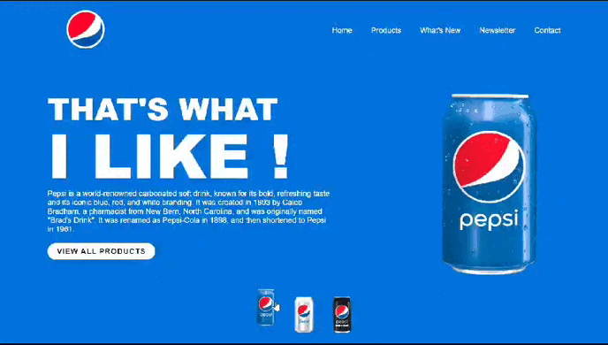
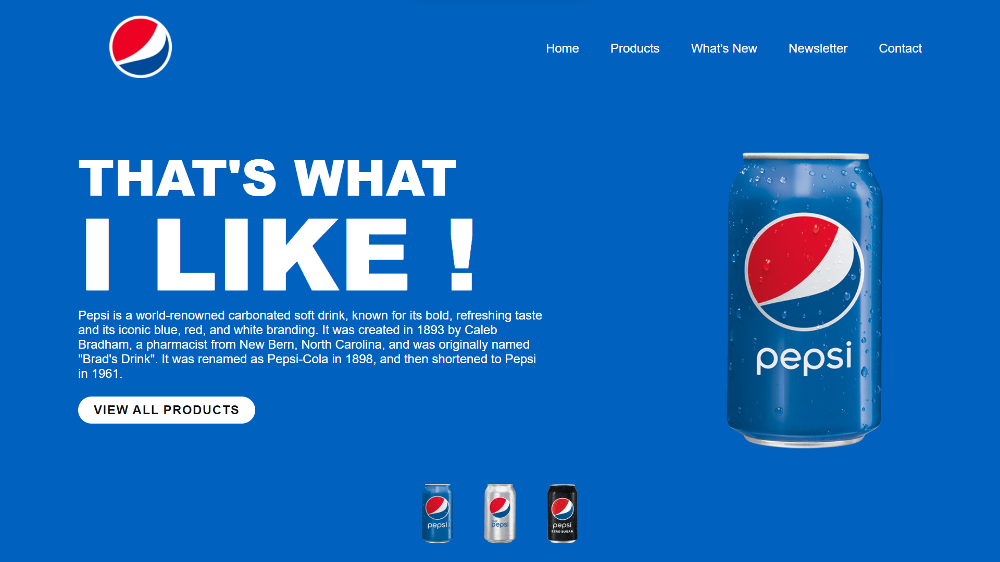
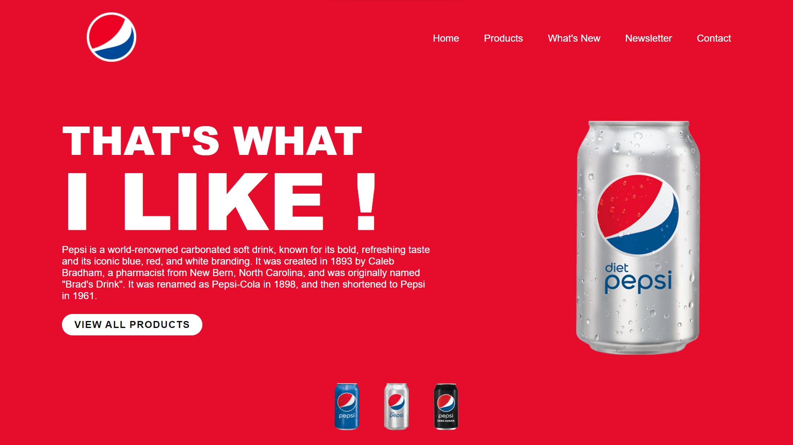
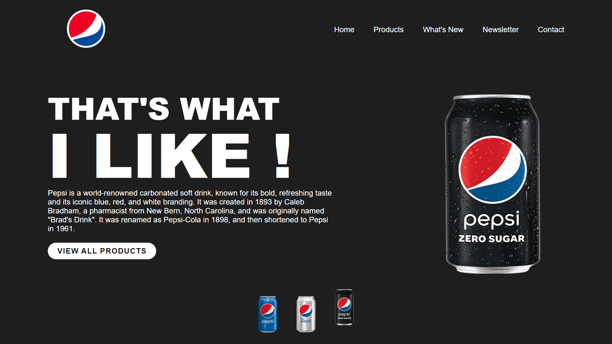

# PepsiDesign

### A new Landing Page Design for Pepsi made using Vue.js.

 

## Overview

This site is a simple landing page for Pepsi with a few basic sections built with Vue.js. It is demonstrated as a vibrant, user-friendly platform dedicated to showcasing Pepsi's products and latest news. 
(DISCLAIMER: This is just a demo site)

### Link to the Website 
<a href="#">Pepsi Landing Page</a>

## Features
*  The main feature is dynamic content update implemented using  Vue.js, handled by the framework's reactivity system.
* features sections are: Home, Products, What's New, Newsletter, and Contact. (These are Dummy Contents)

## Technology Stack
* Vue.js: The front-end is built using Vue.js, a progressive JavaScript framework for building user interfaces.
* HTML/CSS/Js : the website is styled using CSS and Structured using HTML.

## Website ScreenShots:

## Support

Support this project by giving a star and share with your friends.
